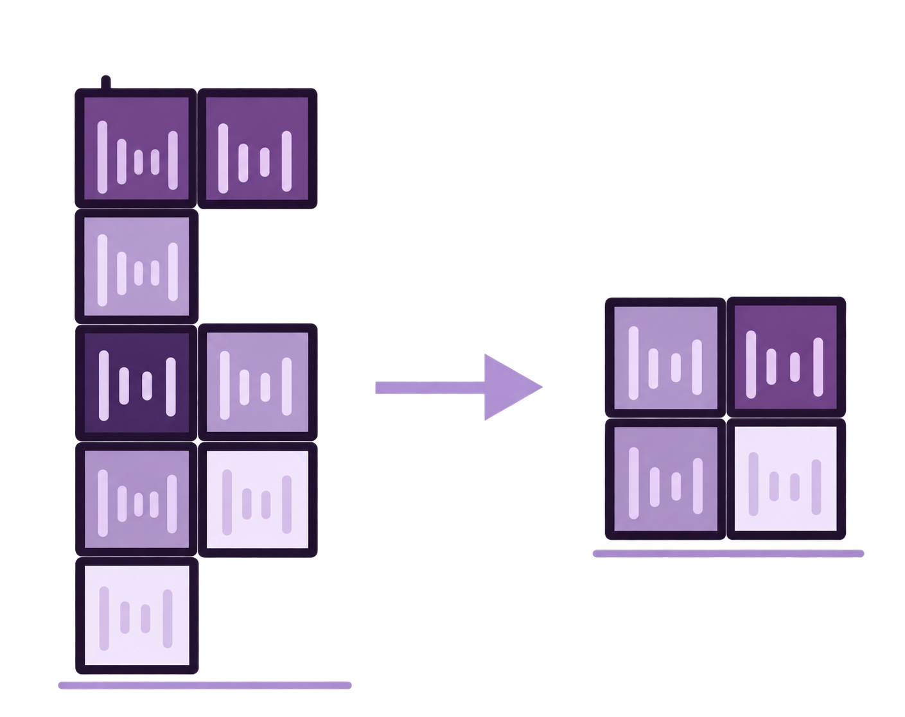
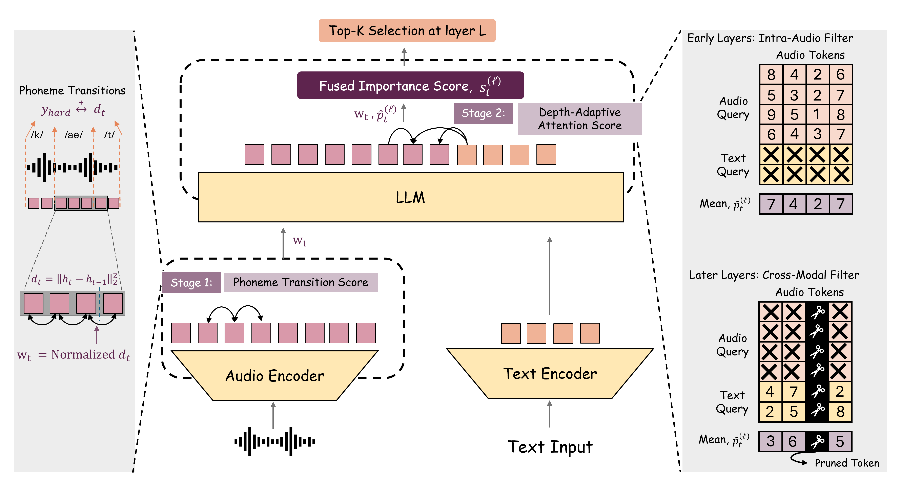

<div align="center">

<h1> AudioTETRIS</h1>

### Token Elimination via Transitional Importance Signals for Efficient Audio LLMs

[](#)
[](#)
[](#release-plan)
[](#how-it-works)

Shreya Sajid, Anna Vettoruzzo, Joaquin Vanschoren

Eindhoven University of Technology

</div>

---

> [!IMPORTANT]
> 🚧 **Release in progress.** The AudioTETRIS implementation, including the pruning modules, backbone calibration and evaluation scripts, will be published here shortly. Follow the repository to hear when it's available.

<p align="center">
  
</p>

## Why compress audio tokens?

Large Audio Language Models turn a few seconds of speech into hundreds of audio tokens, and since decoder self-attention grows quadratically with sequence length, those tokens dominate inference cost. Most of them are redundant: speech carries its information in short bursts at phonetic transitions, with long stretches of steady-state sound in between.

Existing training-free compressors decide what to drop using decoder attention or local feature similarity alone. That treats every audio token as interchangeable and tends to smooth away the very transitions an ASR model needs to recover words.

**AudioTETRIS** keeps those transitions. It reads the structure the audio encoder has already computed and uses it to guide pruning inside the LLM, with no extra training and no auxiliary models.

## How it works

AudioTETRIS scores every audio token in two stages and keeps the top-k at each pruning layer.

1. **Stage 1: Phoneme transition score.** For each token we measure how much the encoder's hidden state jumps from the previous token, $d_t = \lVert h_t - h_{t-1} \rVert_2^2$, taken from a single mid-network encoder layer. Big jumps line up with phoneme boundaries. Normalising $d_t$ to unit mean gives a static acoustic prior $w_t$, computed once before decoding.
2. **Stage 2: Depth-adaptive attention score.** Inside the LLM, the attention signal $\tilde{p}^{(\ell)}_t$ changes with depth. Early layers are dominated by audio tokens attending to each other, so we score with **intra-audio** attention there. Later layers shift toward text queries attending to audio, so we switch to **cross-modal** attention. The switch point is found automatically from a short calibration pass per backbone.
3. **Fusion and selection.** The two signals are multiplied, $s^{(\ell)}_t = \tilde{p}^{(\ell)}_t \cdot w_t$, and the lowest-scoring tokens are evicted from the hidden states and KV cache.

The encoder layer used for $w_t$ is chosen label-free, as the layer where the distribution of $d_t$ is most heavy-tailed (peak kurtosis). Forced alignments are only used to validate that choice, not to run the method.

## Highlights

| | |
|---|---|
| 🎧 **Training-free** | No fine-tuning, adapters or auxiliary models; drop-in for existing LALMs |
| 🧩 **3 backbones** | Qwen2-Audio-7B, Phi-4-Multimodal and Audio Flamingo 3 |
| 📋 **4 tasks** | ASR (LibriSpeech), emotion recognition (IEMOCAP), audio QA (MMAU-mini), speech translation (CoVoST2) |
| ✂️ **Up to 75% of audio tokens removed** | while staying close to uncompressed accuracy |
| 📈 **Gains grow with compression** | the gap over training-free baselines widens as compression gets more aggressive |

On Qwen2-Audio at light compression, AudioTETRIS matches or beats the uncompressed model on several benchmarks. At 75% compression, LibriSpeech WER stays at 8.50 (vs. 4.61 uncompressed and 9.75 for the strongest baseline), while IEMOCAP, MMAU-mini and CoVoST2 remain within about 2 points of full-token performance. See the paper for full results, baselines (SpeechPrune, SparseVLM, LTBM) and ablations.

## Release plan

- ✂️ **Pruning modules** for Qwen2-Audio, Phi-4-Multimodal and Audio Flamingo 3
- 🎚️ **Calibration scripts** to locate the crossover layer and the transition-prior layer for a new backbone
- 📊 **Evaluation pipeline** to reproduce the main tables
- 🔬 **Analysis tools** for the phoneme-transition correlation and kurtosis diagnostics

## Citation

If AudioTETRIS helps your research, we'd appreciate a citation. The entry below will be updated with venue details once the preprint is public.

```bibtex
@article{sajid2026audiotetris,
  title  = {AudioTETRIS: Token Elimination via Transitional Importance Signals for Efficient Audio LLMs},
  author = {Sajid, Shreya and Vettoruzzo, Anna and Vanschoren, Joaquin},
  year   = {2026}
}
```

## Contact

For questions, feedback or collaboration, feel free to open a GitHub issue or email **Shreya Sajid** (<s.sajid@tue.nl>).
